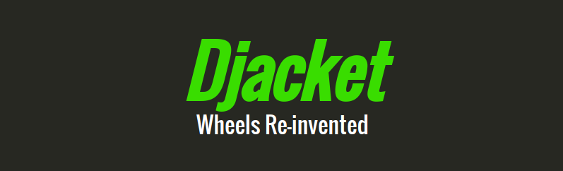

# Djacket
[](https://travis-ci.org/Djacket/djacket)
[](https://github.com/ellerbrock/open-source-badge/)
<br><br>
A free and open source Git server written in [Python/Django](https://www.djangoproject.com/). It's meant to be lightweight and useful.

<p align="center">
	
</p>

# What's New
#### v0.2.0
Djacket is dockerized and so much easier to use. If you are coming from version 0.1.0, please read the [migration guide](https://github.com/Djacket/djacket/wiki/Migration-from-v0.1.0) to keep yourself updated.
#### v0.2.1
A rebase occurred in (April 22, 2018). If you faced merge conflicts upon pulling then just run `git reset --hard origin/master`.


# Requirements
Djacket requires [Docker](https://www.docker.com/) (> v17.03.0-ce) and [Docker Compose](https://docs.docker.com/compose/) in order to work. Follow their instructions to get up and running.


# Getting Started
After cloning the project just type in:
```bash
    ./djacket.sh prod <expose_port>
```
Now open web browser to your host address to see Djacket in production. NGINX logs will appear in nginx/logs and gunicorn logs in run/logs.<br>
This process will also create a superuser with
```
    username: admin
    password: lukedidntknow
```
credentials, if there's not any. Keep in mind to change/remove this and create another one in Django admin panel.


# Update
Now you can update Djacket with only a ```git pull origin master``` call.


# Contribution
For development mode you only have to type in:
```bash
    ./djacket.sh dev <port_number>
```
which takes care of everything. Don't forget about automatic superuser creation discussed above. Happy developing!


# Issues
If you encountered any bugs or issues, Please report it either in Github issues section or send it as
an email to [projectdjacket@gmail.com](mailto:projectdjacket@gmail.com)


# Documentation
Project is fully documented and it can be reached by going to:
```
/admin/doc/
```


# License

The MIT License (MIT)

Copyright (c) 2018 Djacket Project.

Permission is hereby granted, free of charge, to any person obtaining a copy
of this software and associated documentation files (the "Software"), to deal
in the Software without restriction, including without limitation the rights
to use, copy, modify, merge, publish, distribute, sublicense, and/or sell
copies of the Software, and to permit persons to whom the Software is
furnished to do so, subject to the following conditions:

The above copyright notice and this permission notice shall be included in
all copies or substantial portions of the Software.

THE SOFTWARE IS PROVIDED "AS IS", WITHOUT WARRANTY OF ANY KIND, EXPRESS OR
IMPLIED, INCLUDING BUT NOT LIMITED TO THE WARRANTIES OF MERCHANTABILITY,
FITNESS FOR A PARTICULAR PURPOSE AND NONINFRINGEMENT. IN NO EVENT SHALL THE
AUTHORS OR COPYRIGHT HOLDERS BE LIABLE FOR ANY CLAIM, DAMAGES OR OTHER
LIABILITY, WHETHER IN AN ACTION OF CONTRACT, TORT OR OTHERWISE, ARISING FROM,
OUT OF OR IN CONNECTION WITH THE SOFTWARE OR THE USE OR OTHER DEALINGS IN THE SOFTWARE.
